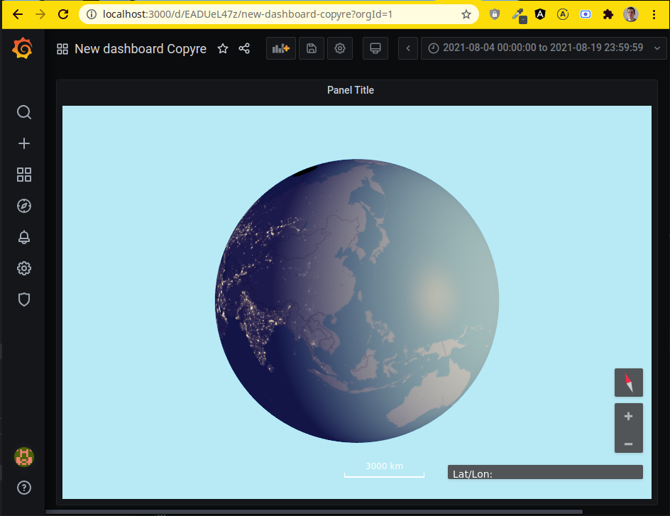

# Example of a Grafana Plugin with openglobus integration

Example of a grafana plugin with openglobus. Grafana plugins are written in reactjs.



## for developers

Install docker and nodejs.

Pull and run the grafana image:

```bash
docker pull grafana/grafana:7.2.0
```

Make sure this plugin is in a `grafana-plugins/` folder and go in it (likely `cd ..` from here).
```
cd .. ; docker run -d -p 3000:3000 -v "$(pwd)":/var/lib/grafana/plugins --name=grafana grafana/grafana:7.2.0
```

Delete
```
docker stop grafana; docker rm grafana
```

List
```
docker ps
```

Restart
```
docker restart grafana
```

```bash
yarn install
```

```bash
yarn watch
```

Build plugin in production mode

```bash
yarn build
```

the login and pasword is `admin`